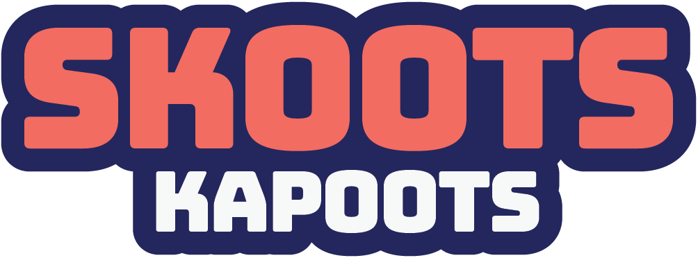
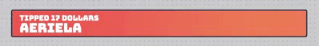
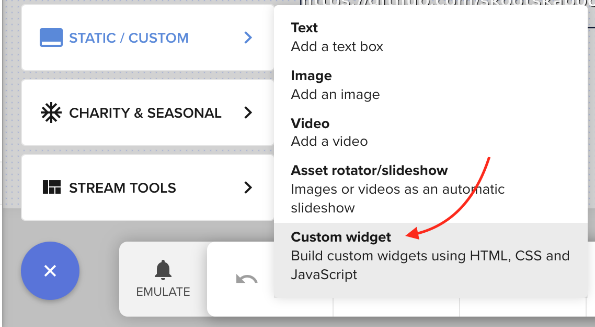
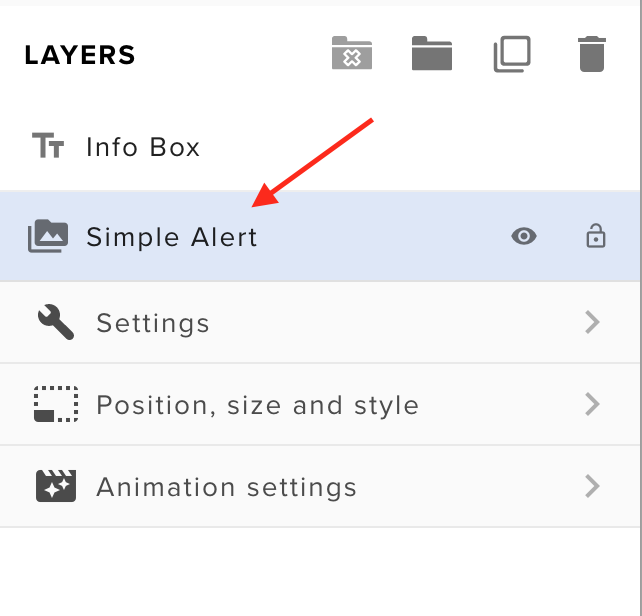
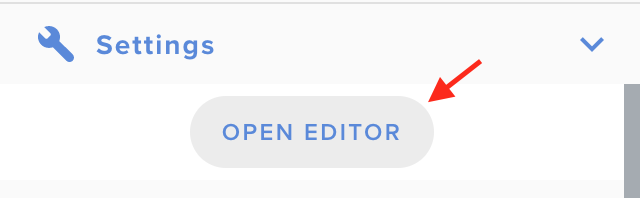

<h1 align="center">
  
</h1>
<h2 align="center">
  
</h2>

[![Release][release-badge]][repo] [![License][license-badge]][license] [![Issues][issues-badge]][issues] [![PRs][prs-badge]][prs] [![Twitch][twitch-badge]][twitch-link] [![Twitter][twitter-badge]][twitter-link] [![YouTube][youtube-badge]][youtube-link] [![Instagram][instagram-badge]][instagram-link]

**SimpleAlerts** is a [StreamElements](https://streamelements.com/) custom widget, which displays a simple, static, and customizable alert bar. It was developed to meet the need to always have the last received event visible, providing some visual and audio flairs for good measure. You can either [download](https://github.com/skootskapoots/simplealerts/releases/latest) the most current release or fork this repo to contribute to the project or further customize the code.

## Who are you, anyway?

I'm just a full-time software engineer by day, and hobby streamer and content creator at night. I'd love to someday pursue my hobbies as a profession, but I'm in no rush where I am today. I stream a couple times a week, and have other projects in the pipe I work on. That said, you can support any of my content channels with likes or follows to let me know you dig what I'm doing. It makes what I do feel that much better!

## Features

- **Sizing:** You determine the height and width of the alert bar.
- **Backgrounds:** You can choose a color or image for the background of the alert bar and announcement slider.
- **Audio:** Chose an audio clip that triggers on a received alert event.
- **Animation:** The announcement slider is in your control, direction, easing, and timing!
- **Fonts:** The title, subtitle, and announcement text can have their own fonts and sizes.
- **Subtitles:** Above the viewers name, you can define custom text for event type of event (follow, sub, cheer, whatever).

## Installation

Installation is a breeze, I promise! Someday, you may find this in the `Widget` area of the `Themes Gallery` in StreamElements. Until then, follow these easy steps to get going:

1. Head over to the [My Overlays](https://streamelements.com/dashboard/overlays) section of StreamElements.
2. Either create a new overlay or edit an existing one you'd like to add this widget to.
3. Once in the editor, you will notice a button at the bottom to add elements to the overlay. 

4. Expand that menu button and select `Static/Custom` then `Custom Widget`. 

5. Select the new layer that was just created, you can even rename it something handy. 

6. Expanding the layer, select `Settings`. 

7. Hit `Open Editor` and copy/paste the [widget code](https://github.com/skootskapoots/simplealerts/tree/master/src) into the appropriate tabs and hit `Done`. 

8. Use the new menu fields on the left-hand side to customize your new simple alert bar!
9. Make sure your layer `Position, size, style` layer tab has a height and width that matches the widget height and width that you entered.
10. Add their overlay as a browser source within OBS or whatever software you use.

## Caveats

While you have a fairly wide range of control of this widget, be aware some values just won't work. Font sizes can pretty easily get out of hand, especially with the stacked nature of the title and subtitle. Fast animation speeds could also pose an issue with the `animationend` event not firing on the element. Make sure you test your configurations before going live!

## Thanks!

Each and every person I meet in this community has been awesome, and I truly appreciate that! Keep on the grind, and have fun!

<!--
Link References
-->

[repo]: https://github.com/skootskapoots/simplealerts/releases/latest "Latest release"
[license]: https://github.com/skootskapoots/simplealerts/blob/master/LICENSE.md "Our license"
[issues]: https://github.com/skootskapoots/simplealerts/issues "View or log an issue"
[prs]: https://github.com/skootskapoots/simplealerts/pulls "Feel free to submit a PR!"
[twitch-link]: http://www.twitch.com/skootskapoots "Check me out on Twitch!"
[twitter-link]: http://www.twitter.com/skootskapoots "I post on Twitter time to time"
[youtube-link]: https://www.youtube.com/channel/UCHkyBxDsnIxB-r3YUJg9qSQ "For more programming and other content"
[instagram-link]: http://www.instagram.com/skootskapoots "I am also a human with a human life!"

<!--
Badge References
-->

[release-badge]: https://img.shields.io/github/v/release/skootskapoots/simplealerts.svg?style=for-the-badge&labelColor=24275d
[issues-badge]: https://img.shields.io/badge/issues-report-red.svg?style=for-the-badge&labelColor=24275d
[prs-badge]: https://img.shields.io/badge/prs-welcomed-green.svg?style=for-the-badge&labelColor=24275d
[twitch-badge]: https://img.shields.io/badge/skootskapoots-twitch-9146ff.svg?style=for-the-badge&logo=twitch&labelColor=24275d
[twitter-badge]: https://img.shields.io/badge/skootskapoots-twitter-00aced.svg?style=for-the-badge&logo=twitter&labelColor=24275d
[youtube-badge]: https://img.shields.io/badge/skootskapoots-youtube-c4302b.svg?style=for-the-badge&logo=youtube&labelColor=24275d
[instagram-badge]: https://img.shields.io/badge/skootskapoots-instagram-3f729b.svg?style=for-the-badge&logo=instagram&labelColor=24275d
[license-badge]: https://img.shields.io/github/license/skootskapoots/simplealerts?color=A31F34&style=for-the-badge&labelColor=24275d
